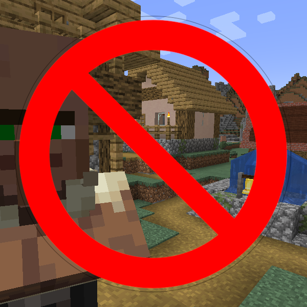

# Dimensional Control


Dimensional Control is a lightweight Minecraft NeoForge mod for <b>Minecraft 1.21.1</b> that allows you to <b>control where resources can spawn</b> based on dimension-based rules. This mod was derived from <b>DimStructRestrict</b>, a mod by <b>Troy Cook (@cookta2012)</b>. This mod provides fine-grained control over world generation and spawning behavior — especially useful for modpack developers and world designers.

---

## 🌍 Features

- Prevent or allow the following resources from generating in specific dimensions:
  - Structures
  - Structure Pool Elements (structure pieces)
  - Features (biome decorations)
  - Entities (spawning mobs and friendly creatures)
  - Loot (items filled in generated chests and item drops)
- Define whitelist or blacklist rules.
- Describe dimension and resource locations with regex to easily create overarching rules.
- JSON-based configuration.
- Provides registries.json to easily look up all possible resource locations that you can use to write your definitions.
- Provides expanded-definitions.json to verify your full definitions once the regex has been expanded.
- Logs rule enforcement with context for debugging.

---

## 🔧 Configuration

The config file is located at:

```
<minecraft_root>/config/dimensionalcontrol/definitions.json
```

If the file doesn't exist, it will be generated with example entries.

### 📐 Structure of `dimstructrestrict.json`

```jsonc
{
  "structures": [ // Defines rules for allowing or denying structures.
    {                                                 
      "dimension": "minecraft:overworld",        // Dimension ResourceLocation (ID).
      "whitelist": ["minecraft:village_plains"], // Allowed structures, defined by ResourceLocation.
    //"blacklist": []                            // Denied structures, cannot be present with whitelist!
      "active": true                             // Whether this rule is active.
    }
  ],
  "structurePoolElements": [ // Defines rules for allowing or denying structure pool elments.
    {
      "dimension": "minecraft:overworld",
      "blacklist": ["minecraft:village/common/well_bottom"],
      "active": true
    }
  ],
  "features": [ // Defines rules for allowing or denying features.
    {
      "dimension": "minecraft:overworld",
      "whitelist": ["minecraft:tree"],
      "active": true
    }
  ],
  "entities": [ // Defines rules for allowing or denying entity spawns.
    {
      "dimension": "minecraft:the_end",
      "blacklist": ["minecraft:enderman"],
      "active": true
    }
  ],
  "loot": [ // Defines rules for allowing or denying loot.
    {
      "dimension": "minecraft:.+",
      "whitelist": ["minecraft:diamond"],
      "active": true
    }
  ]
}
```

---

## 🧠 Rule Types

### ✅ `whitelist`

Only listed resources are allowed. Cannot be present if blacklist is already present!

### ❌ `blacklist`

Listed resources will be prevented. Cannot be present if whitelist is already present!

### 🔄 `active` (optional, default `false`)

Controls whether the rule is enforced. Useful for temporarily disabling rules without removing them.

---

## 🧪 Example Use Case

```jsonc
{
  "structures": [
    { // This rule will only allow all village types (plains, desert, etc.) to generate in the overworld.
      // Other structures in the overworld will not generate!
      "dimension": "minecraft:overworld",
      "whitelist": ["minecraft:village_.+"],
      "active": true
    },
    { // This rule will prevent the generation of bastion remnants in the nether.
      "dimension": "minecraft:the_nether",
      "blacklist": ["minecraft:bastion_remnant"],
      "active": true
    },
  ],
  "structurePoolElements": [
    {  // This rule will prevent wells being added to villages during overworld generation.
      "dimension": "minecraft:overworld",
      "blacklist": ["minecraft:village/common/well_bottom"],
      "active": true
    }
  ],
  "features": [ 
    { // This rule will prevent all features except trees to be placed during overworld biome generation.
      "dimension": "minecraft:overworld",
      "whitelist": ["minecraft:tree"],
      "active": true
    }
  ],
  "entities": [
    { // This rule will prevent enderman from spawning in the end dimension.
      "dimension": "minecraft:the_end",
      "blacklist": ["minecraft:enderman"],
      "active": true
    }
  ],
  "loot": [
    { // This rule will only permit diamonds to be found in all loot pools of all minecraft dimensions.
      // This includes mob and block drops as well as generated chests.
      "dimension": "minecraft:.+",
      "whitelist": ["minecraft:diamond"],
      "active": true
    }
  ]
}
```

---

## 🧑‍💻 Developer Notes

- Author: <b>MattMckenzy</b>
- GitHub: [@MattMckenzy](https://github.com/mattmckenzy)
<br/>

- Original author: <b>Troy Cook</b>
- GitHub: [@cookta2012](https://github.com/cookta2012)

---

## 📄 License

MIT License.

---

## 📬 Feedback & Contributions

Feel free to open an issue or fork the project if you'd like to expand the system (e.g., game rule based control, datapack integration, or GUI support).
